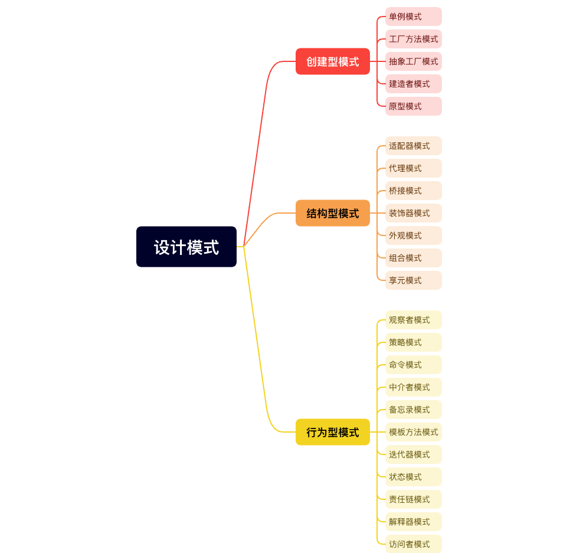

# DesignPatterns
https://github.com/youngyangyang04/kama-DesignPattern
https://kamacoder.com/designpattern.php

## 简介
23个常用模式分为`创建型模式`、`结构型模式`和`行为型模式`三类  
1. 创建型模式关注点是如何创建对象，其核心思想是要把对象的创建和使用相分离，这样使得两者能相对独立地变换。
2. 结构型模式主要涉及如何组合各种对象以便获得更好、更灵活的结构。虽然面向对象的继承机制提供了最基本的子类扩展父类的功能，但结构型模式不仅仅简单地使用继承，而更多地通过组合与运行期的动态组合来实现更灵活的功能。
3. 行为型模式主要涉及算法和对象间的职责分配。通过使用对象组合，行为型模式可以描述一组对象应该如何协作来完成一个整体任务。

## 01Singleton 单例模式
思想：一个类只能有一个实例，并有全局方法来获取该实例 

实现：
1. 构造函数私有化，外部无法直接调用构造函数
2. 私有的静态实例变量
3. 公有的静态方法，来获取该实例  

样例：
1. 饿汉式
2. 懒汉式，延迟创建实例，可以通过双检查机制来优化性能  

`golang`中可以使用`once.Do`来实现单例模式，内部由锁和变量组成，有双检查机制
